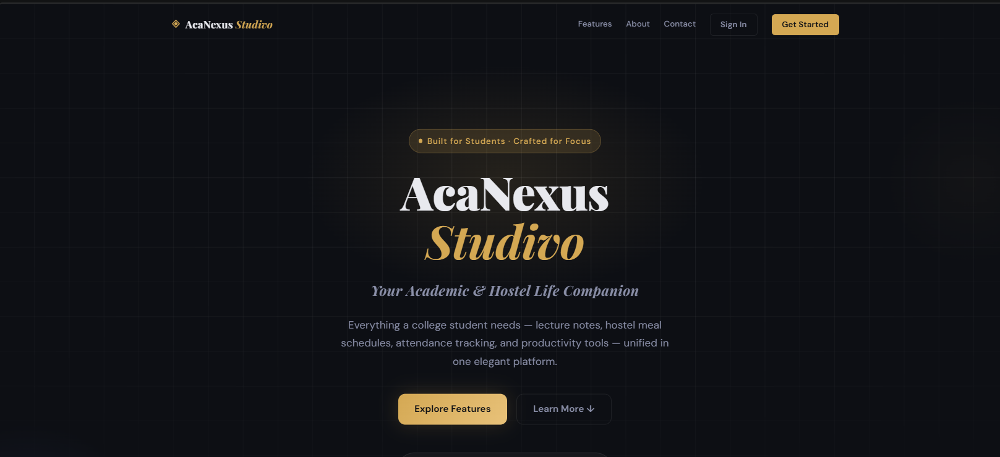
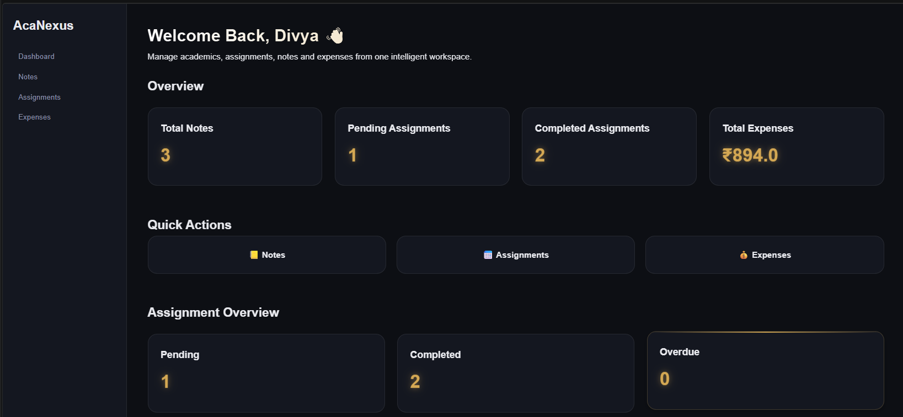
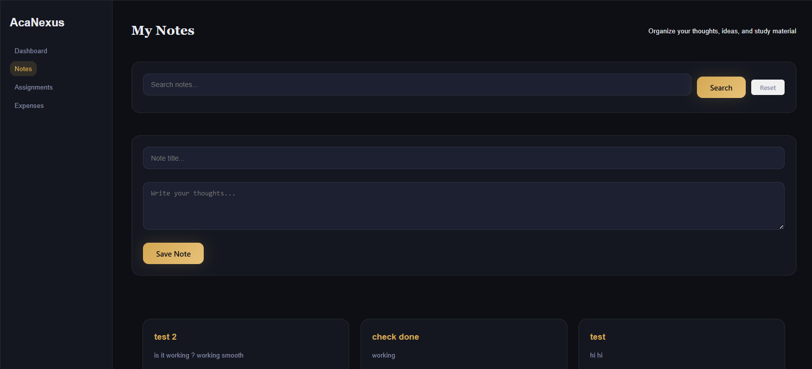
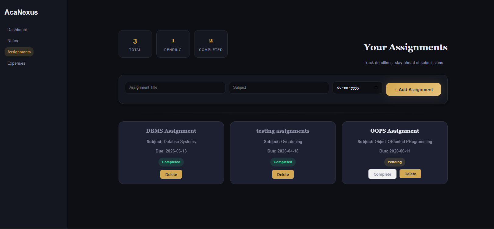
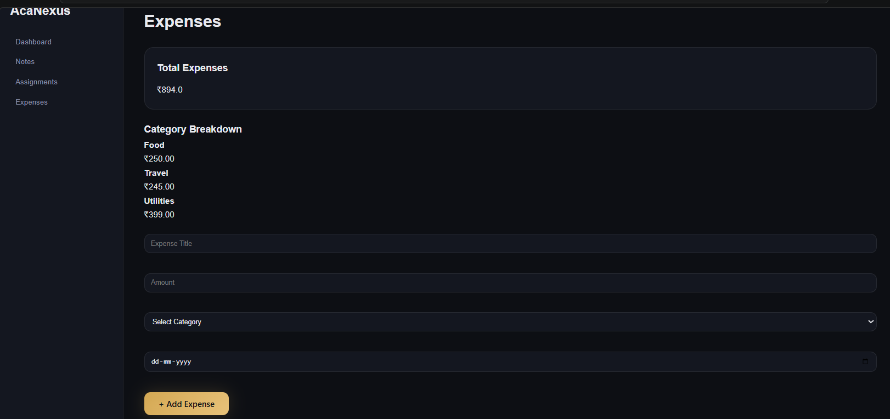

# 🎓 AcaNexus : Studivo

> A modern student productivity platform that helps students manage academics, assignments, notes, and expenses through a unified dashboard.


---

## 📖 Overview

**AcaNexus : Studivo** is a full-stack student productivity and management platform built using Flask, SQLite, HTML, CSS, and JavaScript.

The goal of the project is to provide students with a centralized system where they can manage:

- Academic notes
- Assignments and deadlines
- Personal expenses
- Productivity tracking
- Student life organization

Instead of relying on multiple applications, students can access everything through a single modern dashboard.

This project is being developed as both a practical productivity solution and a portfolio project showcasing full-stack development skills.

---

## ✨ Current Features

### 📊 Smart Dashboard

- Beautiful modern dashboard
- Academic productivity overview
- Notes statistics
- Assignment tracking summary
- Expense insights
- Responsive card layout
- Animated UI components

### 📝 Notes Manager

- Create notes
- Edit notes
- Delete notes
- Search notes instantly
- Organized note cards
- Clean modern interface

### 📅 Assignment Tracker

- Add assignments
- Manage due dates
- Mark assignments as completed
- Automatic overdue detection
- Pending and completed tracking
- Responsive assignment cards

### 💰 Expense Manager

- Add expenses
- Categorize spending
- Track total expenses
- Expense summaries
- Organized expense cards

### 🎨 Modern UI System

- Dark Academic × Modern Tech theme
- Gold accent design language
- Responsive layouts
- Hover animations
- Consistent design system
- Reusable components
- Premium dashboard styling

---

## 🖼️ Screenshots

### 🏠 Homepage



### 📊 Dashboard



### 📝 Notes



### 📅 Assignments



### 💰 Expenses



---

## 🎯 Problem Statement

Students frequently switch between multiple applications for:

- Notes management
- Assignment tracking
- Expense management
- Productivity planning
- Academic organization

This creates unnecessary complexity and inefficiency.

**AcaNexus : Studivo** aims to solve this problem by bringing essential student tools into one integrated platform.

---

## 🚀 MVP Features

The MVP (Minimum Viable Product) includes:

- Dashboard
- Notes Manager
- Assignment Tracker
- Expense Manager

---

## 🔮 Planned Features

### 📚 Academic Hub

- Study Planner
- Exam Countdown
- Semester Tracker
- Academic Analytics
- Attendance Tracker

### 🏠 Hostel Hub

- Expense Splitter
- Roommate Expense Management
- Hostel Notice Board
- Laundry Reminders
- Mess Menu Management

### 👤 Student Profile

- Personalized Dashboard
- Activity Statistics
- Productivity Metrics
- Achievement Tracking

### 🔐 Authentication System

- User Registration
- User Login
- Password Security
- Session Management
- Profile Management

### ☁️ Future Enhancements

- PostgreSQL Migration
- Cloud Deployment
- REST API
- Mobile Responsive Improvements
- AI Study Assistant
- Smart Recommendations

---

## 🛠️ Tech Stack

### Frontend

- HTML5
- CSS3
- JavaScript

### Backend

- Python
- Flask

### Database

- SQLite

### Tools

- Git
- GitHub
- VS Code

---

## 📂 Project Structure

```text
AcaNexus-Studivo/
│
├── app.py
├── requirements.txt
├── README.md
│
├── database/
│   └── acanexus.db
│
├── static/
│   ├── css/
│   │   ├── style.css
│   │   ├── base.css
│   │   ├── layout.css
│   │   ├── components.css
│   │   ├── landing.css
│   │   ├── assignments.css
│   │   ├── notes.css
│   │   ├── expenses.css
│   │   └── animations.css
│   │
│   ├── js/
│   │   └── script.js
|       └── assignments.js
│
├── templates/
│   ├── index.html
│   ├── base.html
│   ├── dashboard.html
│   ├── notes.html
│   ├── edit_note.html
│   ├── assignments.html
│   └── expenses.html
│
└── screenshots/
    ├── Homepage.png
    ├── Dashboard.png
    ├── Notes.png
    ├── Assignment.png
    └── Expenses.png
```

---

## 🎯 Learning Objectives

This project is helping strengthen skills in:

- Full-Stack Development
- Python Programming
- Flask Framework
- Database Design
- SQL Queries
- Frontend Development
- Git & GitHub
- Software Engineering Practices
- UI/UX Design
- Cloud Computing Fundamentals

---

## 📈 Development Roadmap

### ✅ Phase 1

- Project Setup
- Database Setup
- Notes Module
- Dashboard Foundation

### ✅ Phase 2

- Assignment Tracker
- Expense Manager
- UI Improvements
- Responsive Layouts

### 🚧 Phase 3 (Current)

- Authentication System
- Landing Page Integration
- Enhanced Dashboard Analytics
- Improved User Experience

### 🔜 Phase 4

- Cloud Deployment
- PostgreSQL Migration
- Advanced Productivity Features
- AI Assistance

---

## 🤝 Contributions

This project is currently being developed as a personal learning and portfolio project.

Suggestions, feedback, and ideas are always welcome.

---

## 👩‍💻 Developer

### Divya H Kishore

B.Tech Computer Science Engineering Student

GitHub:

https://github.com/Celestial-tech100

---

## ⭐ Support

If you like this project:

- Star the repository
- Follow the project updates
- Share feedback and suggestions

---

### "One dashboard. Every student need."

**AcaNexus : Studivo**
